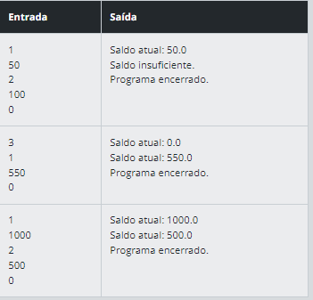
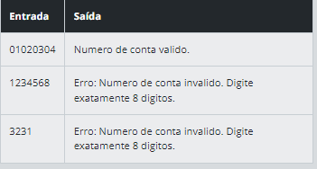

# Condições, Loops e Exceções na Prática com Java

# Sumario

1. [Operações Bancárias Simples com Switch](#operações-bancárias-simples-com-switch)
1. [Verificação de Número de Conta Bancária](#verificação-de-número-de-conta-bancária)
1. 

## Operações Bancárias Simples com Switch

[Link pasta de respsta do desafio](/src/simulacaoBancaria/)

### Descrição

Você está desenvolvendo um programa simples em Java para simular operações bancárias básicas. A aplicação deve permitir ao usuário realizar depósitos, saques e consultar o saldo em uma conta bancária virtual.

### Entrada

O programa exibirá um menu com as seguintes opções:

1. Depositar
2. Sacar
3. Consultar Saldo
4. Encerrar
O usuário escolherá uma dessas opções digitando o número correspondente.

### Saída

Utilizando um switch, o programa realizará a operação escolhida pelo usuário.

Se o usuário escolher:

1: O programa solicitará o valor a ser depositado e atualizará o saldo.
2: O programa solicitará o valor a ser sacado e verificará se há saldo suficiente.
3: O programa exibirá o saldo atual da conta.
0: O programa encerrará.

### Exemplos

A tabela abaixo apresenta exemplos com alguns dados de entrada e suas respectivas saídas esperadas. Certifique-se de testar seu programa com esses exemplos e com outros casos possíveis.

---
## Verificação de Número de Conta Bancária

[Link pasta de resposta do desafio](/src/verificadorNumeroConta/)

### Descrição

Você está desenvolvendo um programa simples em Java para verificar se um número de conta bancária é válido. O número da conta deve ter exatamente 8 dígitos.

### Entrada

O programa solicitará ao usuário que digite o número da conta bancária.

### Saída
O programa utilizará um bloco try-catch para verificar se o número da conta possui exatamente 8 dígitos.
Se o número da conta tiver 8 dígitos, o programa informará que é um número válido.
Se o número da conta não tiver 8 dígitos, o programa lançará uma exceção (por exemplo, _IllegalArgumentException_) e informará que o número da conta é inválido.

### Exemplos
A tabela abaixo apresenta exemplos com alguns dados de entrada e suas respectivas saídas esperadas. Certifique-se de testar seu programa com esses exemplos e com outros casos possíveis.

